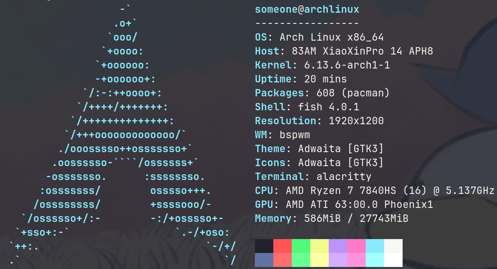
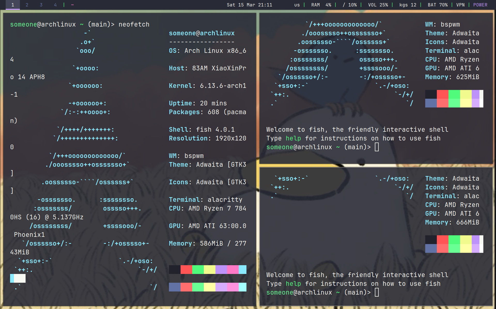
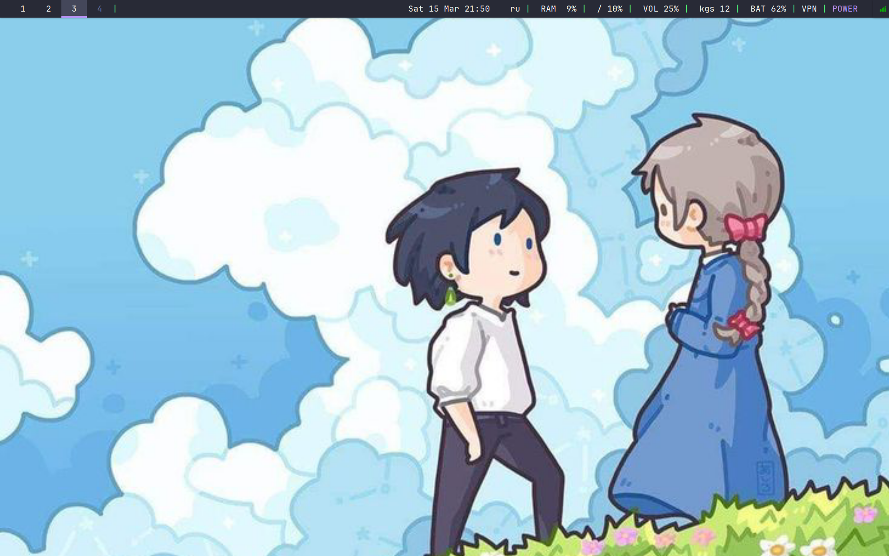

# 🌙 Arch Linux + BSPWM


> *"Minimalism without compromising functionality"*

## ✨ Features

This is a minimal yet functional Arch Linux setup using BSPWM window manager with the Dracula theme - dark background with vibrant accent colors and JetBrains font.

### 🚀 Performance

- Minimal package footprint: **~600 packages**
- Lightweight RAM usage: **~500MB**
- Efficient process management: **~38 running processes**
- Total memory: **~10GB all OS**

### 🔧 Core Components

| Component | Description |
|-----------|-------------|
| **BSPWM** | Tiling window manager |
| **Rofi** | Application launcher and more |
| **Fish** | Default shell |
| **Alacritty** | Terminal emulator |
| **Polybar** | System information display |
| **Firefox** | Default web browser |

## 🛠️ Additional Features

### 🎮 Keyboard Controls
- Fully configured hotkeys for window management, desktop switching, volume and brightness controls
- All configurations in `.config/sxhkkd/sxhkdrc`

### 💻 Development Environment
- Pre-installed programming languages: Python, Go, JavaScript, C, C++
- Development tools: Docker, SSH, base-devel, Clang, Git, CMake, pip

### 📱 Laptop-friendly
- Optimized touchpad settings similar to Windows experience
- Power efficiency mode for longer battery life
- Keyboard backlight support (may require configuration per laptop model)

### 🖥️ Quality of Life
- Neofetch runs on every terminal launch
- Russian keyboard layout configured
- Text editors: Neovim and Nano pre-installed
- Unique wallpaper for each workspace (customizable in `.config/sxhkkd/sxhkdrc`)

## 📷 Gallery

<div align="center">
  
  
  
</div>

## ⚙️ Configuration

Most configurations are located in the following directories:

```
~/.config/bspwm/     # BSPWM configuration
~/.config/sxhkd/     # Keyboard shortcuts
~/.config/polybar/   # Status bar configuration
~/.config/alacritty/ # Terminal configuration
~/.config/rofi/      # Application launcher
~/.config/fish/      # Shell configuration
```

## Installation
Just clone and move all files to your ~/
